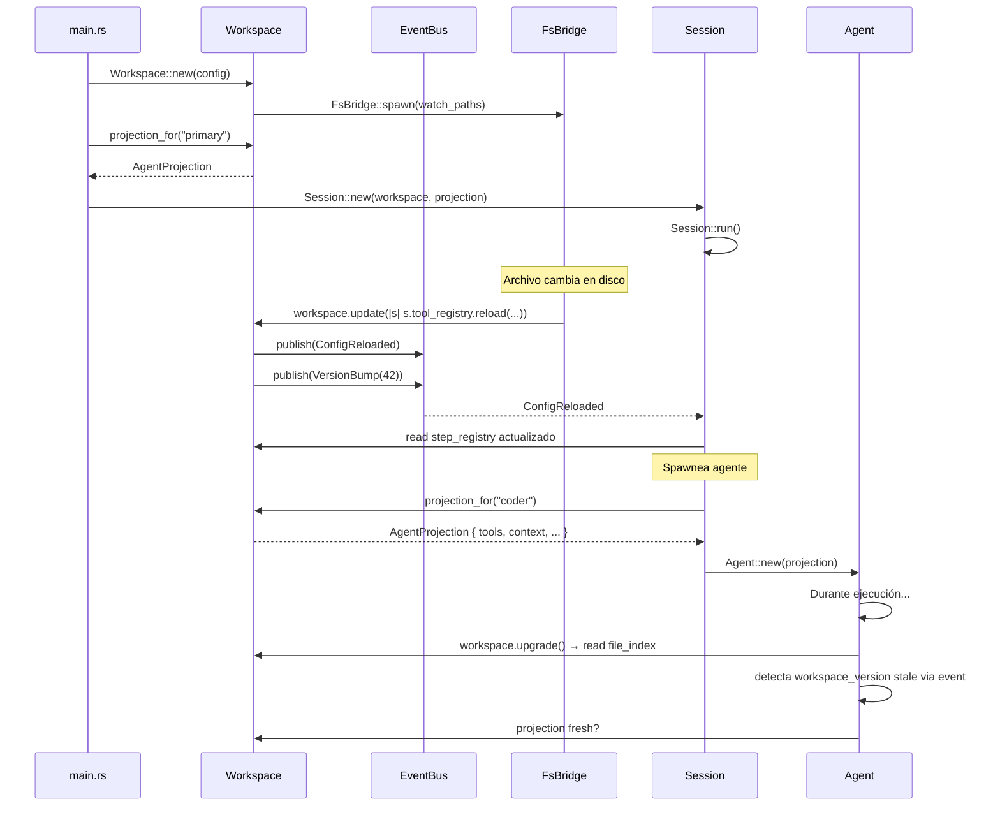

check: https://github.com/masamasa59/ai-agent-papers

we want some dynamic tools reading to have the latest tools created from other agents
I can't see why we would need something other than agents, an agent is a llm client with a field supervisor, that is the hashmap to children process

the main workflow should be:
the user starts a session. First it will share an idea with the AI agent.
the ai agent will ask questions to define requirements, constrains and expectations.
the ai agent will then create a plan, ask the user to confirm it and keep asking questions if there are ambiguities
once the plan defined the ai agent will start to execute the plan

assistant, user and tool seem to be the only "variants" actually kept in the messages types

lsm tree looks like a good fit for the context, this shit is just a database, we need materialized views that we can send to the agents and do their stuff. we ahve some append only log for what happens, some logic to have a view of what an agent needs.

tools and hooks (and probably the whole config itself)  should be dynamic, I don't really see a reason why it shouldn't be, the question is what the latency should be between a new tool/hook and the current ones, should we be eager or lazy? not sure it matters, because if an agent changes a file that still points to an executable file, it would have changed anyways, fuck we need some versioning there as well? how to manage it?

so I'll need at least 4 loops. One that listens for files and config changes, another for listening to the user's input, another for the agent/agents

I need to make everything more event driven so I can keep logs of the steps, things done and be able to have better info

so apparently all the context is cached, meaning that all the 'prompt' struct sent to the agent is kept in cache by the server provider

