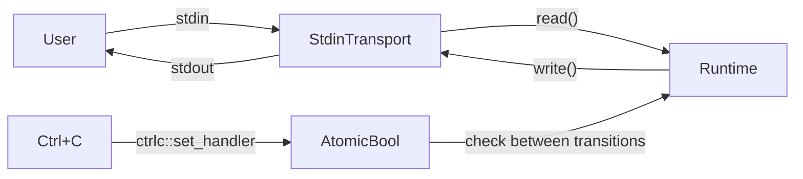

# Architecture

## Data flow



## Component layout

### Entry point (`src/main.rs`)
- Loads config
- Creates `Runtime`, `StdinTransport`
- Calls `runtime.run()` (synchronous)
- Exits via `std::process::exit(0)` after the loop

### Runtime (`src/runtime_trait.rs`)
- Holds `Config`, `AgentFactory`, `cancelled: Arc<AtomicBool>`, and
  no state machine storage — the next handler is a local loop variable.
- `run()` — synchronous loop:

```
let mut f: StateFn<T, Ctx> = <Plan as Step>::run::<T, Ctx>;
loop {
    if self.cancelled.load(Ordering::Relaxed) { break; }
    match f(self) {
        StateMachine::Continue(next) => f = next,
        StateMachine::Done => break,
    }
}
```

### Step trait and dispatch

Each state is a distinct struct implementing `Step`. The `Ok`/`Err` associated
types declare the valid transition graph at compile time. `run()` returns
`StateMachine<T, Ctx>` directly — states use
`<Self::Ok as Step>::run::<T, Ctx>` / `<Self::Err as Step>::run::<T, Ctx>` to
select their successor:

```rust
trait Step {
    type Ok: Step;     // forward transition on success
    type Err: Step;    // backtrack/retry on failure

    /// Execute this state and return the next state function, or Done.
    fn run<T: Transport, Ctx: ContextManagement>(
        rt: &mut Runtime<T, Ctx>,
    ) -> StateMachine<T, Ctx>;
}
```

### State types (`src/runtime_trait.rs`)

| State | `Ok` (forward) | `Err` (backtrack) | Transition |
|---|---|---|---|
| `Plan` | `PlanDraft` | `Plan` | `Continue(<PlanDraft>::run)` → fwd, `Continue(<Plan>::run)` → retry, `Done` → exit |
| `PlanDraft` | `PlanApproved` | `Plan` | `Continue(<PlanApproved>::run)` → fwd, `Continue(<Plan>::run)` → restart |
| `PlanApproved` | `Implement` | `Plan` | `Continue(<Implement>::run)` → fwd |
| `Implement` | `Test` | `Plan` | `Continue(<Test>::run)` → fwd |
| `Test` | `Commit` | `Implement` | `Continue(<Commit>::run)` → fwd, `Continue(<Implement>::run)` → backtrack |
| `Commit` | `Done` | `Done` | `Continue(<Done>::run)` → Done returns `Done` → stop |
| `Done` | `Done` | `Done` | `Done` — loop exits |

All states have working interactive logic — prompts, branching, I/O via
the transport. State functions receive `&mut Runtime` and access the
transport and agent factory through it.

### Transport (`src/transport.rs`)
- Trait: `fn read() -> Result<String, String>` + `fn write(&str) -> Result<(), String>`
- `StdinTransport` — blocking `std::io::stdin().read_line()` / `std::io::stdout().write_all()`

### LLM Client (`src/llm/client.rs`)
- Async `LlmClient` trait (separate from the sync state machine)
- OpenAI `Client` via reqwest (async)
- Not yet wired into state functions

## Graceful shutdown chain

```
Ctrl+C
  → ctrlc handler sets AtomicBool to true
    → Runtime::run() checks flag at top of loop
      → loop breaks
        → main() logs "Fyah stopped"
          → std::process::exit(0)
```

## Dispatch types

- `type StateFn<T, Ctx>` — `fn(&mut Runtime<T, Ctx>) -> StateMachine<T, Ctx>`.
  A plain function pointer, 8 bytes, no heap alloc, no vtable.
- `StateMachine<T, Ctx>` — enum with `Continue(StateFn)` (advance) and `Done`
  (stop). Returned by each state's `run()` method.
- No domain enums, no `dyn`, no `Box`.
