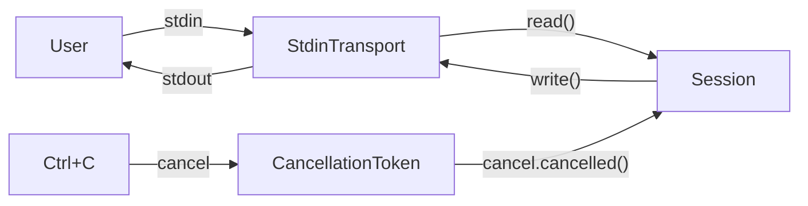

# Architecture

## Data flow (current)



## Component layout

### Entry point (`src/main.rs`)
- Loads config
- Creates `Session`, `StdinTransport`, `CancellationToken`
- Spawns `shutdown_signal()` task → cancels token on Ctrl+C/SIGTERM
- Calls `session.run(transport, cancel).await`

### Session (`src/session.rs`)
- Holds `Config`
- `run(transport, cancel)` — `biased; tokio::select!` loop (cancellation checked first):
  - `cancel.cancelled()` → break
  - `transport.read()` → match EOF / input / error → echo → `transport.write()`

### Transport (`src/transport.rs`)
- Trait: `read() -> Result<String, String>` + `write(&str) -> Result<(), String>`
- `StdinTransport` (Unix) — `AsyncFd<std::io::Stdin>` for input (epoll/kqueue, no background thread), `BufWriter<Stdout>` for output
- `StdinTransport` (non-Unix) — `BufReader<tokio::io::Stdin>` fallback

### Waiting components (not yet wired into the loop)
- `Agent` actor (`src/agent.rs`) — LLM conversation loop
- `Supervisor` (`src/supervisor.rs`) — spawn/cancel child actors
- `Client` / `LlmClient` (`src/client.rs`) — LLM API abstraction

## Graceful shutdown chain

```
Ctrl+C or SIGTERM
  → shutdown_signal() returns
    → cancel() on root CancellationToken
      → Session::run() select! fires cancel.cancelled() branch
        → loop breaks
          → main() logs "Fyah stopped"
            → process exits
```
