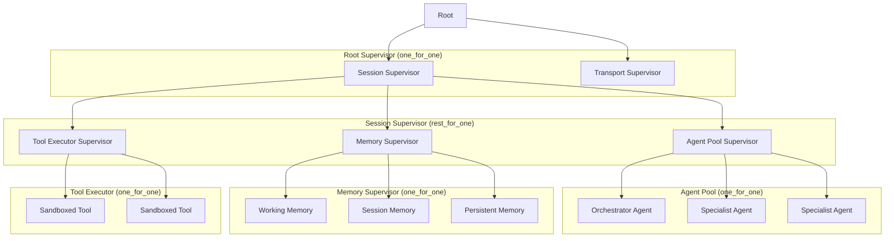

# Brainstorm: Fyah Session Structure & Agent Architecture

> SOTA research synthesis + architectural proposal for Fyah.
> Date: 2026-06-10
> Based on: Agent Harness Engineering surveys (ETCLOVG), Anthropic/OpenAI agent SDKs,
> LangGraph supervisor patterns, Erlang/OTP supervision trees, and recent context management papers.

---

## Part 1: SOTA Landscape Summary

### 1.1 The ETCLOVG Taxonomy (Agent Harness Engineering Survey, 2026)

The field has converged on **seven layers** that any production agent harness must address:

| Layer | What it covers | Fyah status |
|-------|---------------|-------------|
| **E** Execution environment | Sandbox, runtime isolation, process lifecycle | Partial (tokio runtime) |
| **T** Tool interface | Tool description, discovery, invocation (MCP/A2A) | Skeleton (`tools.rs`, `client.rs` Tool types) |
| **C** Context management | Short-term (window), session-level, persistent memory | None (raw `Vec<Message>`) |
| **L** Lifecycle/Orchestration | Single-agent loop → multi-agent → full task pipelines | `Session::run()` loop exists, Agent/Supervisor unwired |
| **O** Observability | Traces, costs, failures, reliability signals | None |
| **V** Verification | Evaluation, failure attribution, regression feedback | None |
| **G** Governance | Guardrails, HITL, audit, rate limits | None (hook points defined but unimplemented) |

**Key insight:** "The harness, not the model, is the binding constraint for real-world agent system performance." Fyah is currently implementing layers E and L — the other five layers are greenfield.

### 1.2 Context Management — The Hardest Problem

Six SOTA approaches, each with a different philosophy:

1. **Adaptive Context Management** (LangGraph-based, enterprise deployed)
   - Pre-flight token budget checking before every LLM call
   - Tiered compression: recent N pairs verbatim, older history summarized (3:1 to 8:1)
   - Sub-agent isolation: each sub-agent gets its own context scope
   - Sustains 100+ turn sessions at <85% context utilization

2. **Memory-as-Action / MemAct** (ICLR-style)
   - Context curation is a *learned policy*, not external rules
   - Agent decides via explicit function calls when to retain/compress/discard
   - Treats memory as an active control surface, not passive storage

3. **CAT — Context as a Tool**
   - Context management elevated to a *callable tool* in the agent's toolset
   - Structured workspace: stable task semantics + condensed long-term memory + high-fidelity short-term working memory
   - Agent proactively triggers compression at stage boundaries

4. **U-Fold — Intent-Aware Context Folding**
   - Keeps full history but builds a compact *working context* per turn
   - Conversation summarization (tracks evolving user intent + to-do list)
   - Dynamic data extraction (filters tool outputs to current-goal-relevant fields)
   - Best for user-centric / conversational scenarios

5. **ContextBudget / BACM**
   - Treats context as a **budget-constrained sequential decision problem**
   - Agent decides when to compress based on remaining budget headroom
   - RL-optimized compression strategy under varying budgets

6. **AgentProg — Program-Guided Context Management**
   - Uses code/programs as the organizing structure for context
   - Discards what is not referenced in the program's data flow
   - Best for long-horizon GUI/OS automation tasks

**Synthesis for Fyah:** A hybrid approach is best — pre-flight budget checking + tiered summarization (from Adaptive CM) for general use, with a CAT-like "context compression tool" the agent can call explicitly. The supervisor should enforce per-sub-agent context isolation as the primary mechanism for preventing context bloat.

### 1.3 Orchestration Patterns — What Production Looks Like

**State Machines beat free-form for reliability:**
- StateFlow (COLM 2024): 13-28% higher task success, 3-5× cost reduction vs ReAct
- MetaAgent (ICML 2025): FSM-based multi-agent systems auto-constructed and optimized
- LangGraph, Google ADK, Stately Agent all converged on state-graph primitives
- **Pattern: Outer FSM + inner LLM autonomy** — state machine governs macro workflow stages; within each stage, the LLM operates freely

**Supervision Trees (Erlang/OTP for agents):**
| Strategy | Behavior | Agent Mapping |
|----------|----------|---------------|
| `one_for_one` | Restart only failed child | Independent specialist agents |
| `one_for_all` | Restart all children | Agents sharing mutable context |
| `rest_for_one` | Restart failed child + dependents | Pipeline agents (A→B→C) |

- Restart types: `permanent` (always), `transient` (abnormal only), `temporary` (never)
- Restart intensity budget (`max_restarts` / `max_seconds`) prevents restart storms
- Production Rust implementations exist: `joerl`, `tokio-actors`, `cineyma`

**Graph-Based Orchestration (GraphBit, MASFactory):**
- Workflows as DAGs with typed edges (control flow, message flow, state flow)
- Three-tier memory: ephemeral scratch (per-node), structured state (workflow key-value), external connectors (DBs/APIs)
- Rust-based execution engine achieves 11.9ms latency, 5025 ops/min

### 1.4 Protocol Layer — MCP/A2A/TEA

| Protocol | Layer | Purpose |
|----------|-------|---------|
| **MCP** | Agent → Tool | Standardized tool discovery and invocation |
| **A2A** | Agent → Agent | Inter-agent communication |
| **TEA** | Unified | Tool-Environment-Agent protocol (hierarchical) |
| **ACP** | Agent → Agent | Alternative agent communication protocol |

### 1.5 What Claude & OpenAI Ship

**Claude Agent SDK loop:** `gather context → take action → verify work → repeat`
- Structured outputs (JSON Schema guarantee)
- Tool search tool (discover tools dynamically, defer loading)
- Programmatic tool calling (orchestrate via code, not round-trips)
- Subtypes: `success`, `error_max_turns`, `error_max_budget`, `error_during_execution`

**OpenAI Agents SDK primitives:**
- `Agent` (instructions + tools + handoffs + guardrails)
- `Runner.run()` (orchestrates turns end-to-end)
- Handoffs (first-class agent-to-agent delegation)
- Session management (automatic conversation history)
- Built-in tracing with OpenTelemetry export

---

## Part 2: Architectural Proposal for Fyah

### 2.1 High-Level Vision

Fyah should become a **state-machine-driven agent harness** with an Erlang/OTP-style supervision tree, tiered context management, and built-in observability. The architecture must support:

- **Single-user interactive sessions** (current CLI use case)
- **Headless / server mode** (HTTP/WebSocket transport for tooling)
- **Multi-agent workflows** (supervisor delegates to specialist agents)
- **Long-running tasks** (persistent sessions with context management)

### 2.2 Proposed Session State Machine

Instead of the current `Steps` enum (Planning/Implementing/Testing/Committing), a proper FSM:

```mermaid
stateDiagram-v2
    [*] --> Initializing
    Initializing --> Idle : config loaded, agents ready
    
    Idle --> Processing : user input received
    Processing --> Planning : task needs decomposition
    Processing --> Executing : direct tool/LLM call
    Processing --> Verifying : results need validation
    
    Planning --> Executing : plan ready
    Executing --> Verifying : tool/LLM response
    Verifying --> Idle : verified, response ready
    
    Idle --> [*] : cancellation / EOF
    
    state Processing {
        [*] --> Routing
        Routing --> LLM_Turn
        Routing --> Tool_Call
        LLM_Turn --> Tool_Call : tool_use detected
        Tool_Call --> LLM_Turn : tool result ready
        LLM_Turn --> [*] : end_turn
    end
```

**Key properties:**
- States map to concrete struct variants (enforced by type system)
- Transitions are explicit — no LLM decides the macro-level flow
- History pseudo-states allow resumption after interruption
- Orthogonal regions for concurrent concerns (e.g., rate-limit monitoring during execution)

### 2.3 Supervision Tree



**Restart strategy decisions:**
- **Root → Session**: `one_for_one` — transport failure and session failure are independent
- **Session → children**: `rest_for_one` — memory must survive before agents can use it; tools depend on memory for config
- **Agent Pool**: `one_for_one` — agents are independent specialists
- **Memory**: `one_for_one` — each memory tier is independently restorable
- **Tool Executor**: `one_for_one` — tools are stateless and independently restartable

**Restart intensity:** Max 3 restarts per 10 seconds per supervisor, then escalate upward.

### 2.4 Agent Hierarchy

```
User Input
    │
    ▼
Orchestrator Agent  (one per session)
    │
    ├── Assesses intent, decomposes task
    ├── Maintains global plan / to-do list
    ├── Delegates to specialist agents
    └── Synthesizes final response
         │
         ├── Agent: Researcher    (web search, RAG)
         ├── Agent: Coder         (code generation, file editing)
         ├── Agent: Analyst       (data analysis, computation)
         └── Agent: Verifier      (validates outputs, runs tests)
```

**Orchestrator responsibilities:**
1. **Intent recognition** — classify user request
2. **Task decomposition** — break into sub-tasks with dependency graph
3. **Agent dispatch** — spawn sub-agent with clean context, restricted toolset, capped budget
4. **Result aggregation** — collect sub-agent outputs, resolve conflicts
5. **Context management** — decide when to compress/summarize session history
6. **Error recovery** — retry, re-route, or escalate on sub-agent failure

**Sub-agent lifecycle:**
1. Orchestrator creates sub-agent with: system prompt, tools, budget (iterations/tokens), context
2. Sub-agent runs independently in isolated context scope
3. Sub-agent writes results to structured shared memory (blackboard pattern)
4. Sub-agent terminates (success, max iterations, error)
5. Orchestrator reads results, handles cleanup

### 2.5 Context Management Architecture

Three tiers of memory, adapted from the SOTA:

```
┌─────────────────────────────────────────────────┐
│                WORKING MEMORY                    │
│  (current turn: verbatim, bounded to N pairs)   │
│  ~4K tokens - no compression                    │
├─────────────────────────────────────────────────┤
│               SESSION MEMORY                     │
│  (this session: tiered compression)             │
│  Recent: verbatim │ Middle: summarized          │
│  Old: condensed to structured notes             │
├─────────────────────────────────────────────────┤
│              PERSISTENT MEMORY                   │
│  (cross-session: skills, patterns, user prefs)  │
│  Vector store + structured key-value            │
└─────────────────────────────────────────────────┘
```

**Pre-flight context check (before every LLM call):**
1. Estimate token budget for current request
2. If budget < threshold: trigger tiered compression
3. If still over budget: isolate into sub-agent with fresh context
4. If still over budget: return error ("context limit reached")

**Compression strategies:**
- **Sliding window** (simplest): keep last N turns verbatim
- **Summarization** (middle): LLM summarizes oldest turns into structured notes
- **CAT-style** (advanced): agent has a `compress_context` tool to proactively manage
- **Budget-aware** (future): learned compression policy based on remaining budget

### 2.6 Session Message Flow

```
┌──────────────────────────────────────────┐
│              TRANSPORT LAYER              │
│  StdinTransport / TCPServerTransport     │
│  read() / write()                        │
└──────────────────┬───────────────────────┘
                   │ PromtpMsg / Event
┌──────────────────▼───────────────────────┐
│           SESSION SUPERVISOR             │
│  - FSM: state transitions                │
│  - Cancellation propagation              │
│  - Error classification                 │
└──────────────────┬───────────────────────┘
                   │
┌──────────────────▼───────────────────────┐
│          ORCHESTRATOR AGENT              │
│  - Intent classification                 │
│  - Task decomposition                    │
│  - Sub-agent dispatch                    │
│  - Result synthesis                      │
└──────────────────┬───────────────────────┘
                   │
          ┌────────┴────────┐
          ▼                  ▼
┌──────────────┐   ┌──────────────┐
│  Specialist  │   │  Tool Exec   │
│  Agent (N)   │   │  Sandbox     │
└──────────────┘   └──────────────┘
```

### 2.7 Observability (built-in from day one)

```
Span tree per session:
├── session_id (root span)
│   ├── turn_001
│   │   ├── llm_call (model, tokens, latency)
│   │   ├── tool_call (tool, args, result, duration)
│   │   └── context_compress (before, after tokens)
│   ├── turn_002
│   │   └── ...
│   └── turn_N
```

**Tracking per turn:**
- Token usage (input + output, per model)
- Cost (USD, by provider)
- Latency (wall clock per LLM call, per tool call)
- Tool call count and distribution
- Context window utilization (% used before/after compression)
- Error rate by category

**Export:** OpenTelemetry-compatible spans, structured JSON log sink.

### 2.8 Governance Layer

```toml
# Example config (extending existing hooks)
[governance]
max_cost_per_session = 5.00          # USD
max_tokens_per_session = 1_000_000
max_turns_per_session = 500
require_human_approval = ["deploy", "delete", "write"]

[governance.guardrails.input]
max_length = 10000
deny_patterns = ["rm -rf /", ...]

[governance.guardrails.output]
require_structured = true
max_cost_per_turn = 0.50
```

### 2.9 Fyah-Specific Design Decisions

| Decision | Choice | Rationale |
|----------|--------|-----------|
| State machine framework | Custom Rust enum-based FSM (not crate) | Type safety, zero-dependency, explicit transitions. Can evolve to statechart crate later. |
| Actor model | Supervisor struct exists ✓ — extend with OTP strategies | Already have the right abstraction. Add restart strategies, child monitoring, bounded mailboxes. |
| Context compression | Tiered summarization (default) + CAT-style tool (optional) | Balances simplicity with power. Summarization is the most battle-tested approach. |
| Agent isolation | New CancellationToken per sub-agent | Already have CancellationToken infrastructure. Sub-agents get fresh context + budget. |
| Inter-agent communication | Structured shared memory (files/DB) + typed channels | Files for large artifacts (code, data), channels for coordination messages. |
| Protocol support | MCP for tool integration (priority 1), A2A for agent interop (later) | MCP is the most widely adopted open protocol. A2A value increases with multi-agent complexity. |
| LLM provider | LlmClient trait ✓ — stays generic | Already done. Add streaming, structured output constraints. |
| Observability | Tracing spans (existing `tracing` crate) + metrics | Already using `tracing`. Add structured spans with OpenTelemetry naming convention. |

### 2.10 Migration Path (Incremental)

**Phase 1 (current — T05/T06):** Fix StdinTransport, cleanup, sync context.
**Phase 2 (next):** Wire Agent into session loop. Agent becomes the "brain" inside the session.
**Phase 3:** Upgrade Supervisor with OTP-style restart strategies (one_for_one, rest_for_one, restart budgets).
**Phase 4:** Add Session FSM — replace ad-hoc loop with explicit state machine.
**Phase 5:** Tiered context management (working memory → session memory → compression).
**Phase 6:** Multi-agent orchestration (Orchestrator Agent delegates to specialist sub-agents).
**Phase 7:** Observability spans, governance guardrails, MCP tool protocol support.

---

## Part 3: Key Open Questions for Discussion

1. **FSM vs graph-based orchestration:** Should Fyah use a statechart (hierarchical FSM) or a DAG-based execution engine (like LangGraph)? The FSM is simpler and maps well to the interactive session use case. The DAG is better for batch workflows.

2. **Context compression strategy:** Should compression be automatic (pre-flight check + tiered summarization) or agent-driven (CAT-style tool)? **Best answer: both.** Automatic as default, with a `compress_context` tool the agent can call explicitly.

3. **Sub-agent spawning model:** Should sub-agents be pre-spawned (pooled) or spawned on-demand? **On-demand** is simpler and fits the interactive use case. Pre-spawned makes sense for server mode.

4. **Inter-agent memory:** Blackboard pattern (shared structured file store) vs message-passing (channels)? **Hybrid:** channels for control messages, shared memory for large results. The existing Supervisor channels are fine for coordination.

5. **OTP strategy granularity:** Should the restart strategy be per-supervisor or per-child (as in OTP)? **Per-child** — `tokio-actors` and `cineyma` both support this, and it's strictly more expressive.

6. **Built-in observability vs optional:** Should tracing be compiled in by default or behind a feature flag? **Default-on with sampling rate config** — you can't debug what you don't measure.

---

## References

1. *Agent Harness Engineering: A Survey* (2026) — ETCLOVG taxonomy, 170+ projects mapped
2. *Adaptive Context Management for Long-Running LLM Agent Sessions* (2025) — Pre-flight checking, tiered compression
3. *Memory as Action: Autonomous Context Curation* (2025) — MemAct framework
4. *CAT: Context as a Tool* (2025) — Structured context workspace
5. *U-Fold: Dynamic Intent-Aware Context Folding* (2026) — User-centric context folding
6. *ContextBudget: Budget-Aware Context Management* (2026) — Budget-constrained compression
7. *AgentProg: Program-Guided Context Management* (2025) — Code-guided context for GUI agents
8. *StateFlow: FSM-based Agent Workflows* (COLM 2024) — 13-28% improvement over ReAct
9. *Supervisor Trees and Fault Tolerance for AI Agents* (Zylos Research, 2026) — OTP patterns for agents
10. *Finite State Machines and Statecharts for AI Agent Orchestration* (Zylos Research, 2026)
11. *Structured Concurrency and Task Supervision in Multi-Agent Systems* (Zylos Research, 2026)
12. *GraphBit: Graph-based Agentic Framework* (2026) — Rust-based execution engine, 3-tier memory
13. *SDOF: State-Constrained Dispatch* (2026) — Goal-scoped governance memory
14. Anthropic Claude Agent SDK docs (2025-2026)
15. OpenAI Agents SDK / Swarm (2024-2026)
16. LangGraph Supervisor pattern (LangChain, 2025)
17. `tokio-actors`, `cineyma`, `joerl` — Rust OTP-style actor libraries
